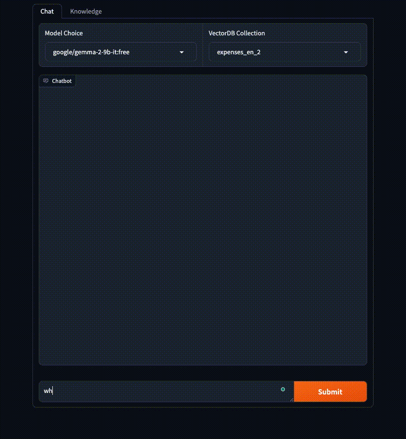

While the LLM is powerful already, it is not impossible to extend its capability to answer the question according to our private data (which never exposed to the LLM itself before). In this part, we will explore how to inject the LLM with our data and ask anything about it!


*In this part, we will extend the code from the first part. So if you haven't see it yet, please have a look [here](https://fhrzn.github.io/posts/building-conversational-ai-context-aware-chatbot/).*

>⚡️ Additionally, if you want to jump directly to the code, you may access it [here](https://github.com/fhrzn/study-archive/tree/master/simple-rag-openrouter/talk-with-data).

Let's gooo! 💪


## Introduction to RAG
Before we start, let's first talk about what is RAG and why we should know about it.

So, RAG stands for **Retrieval Augmented Generation** is a method which we will use to inject additonal knowledge (our private data) to the LLM. Note that the LLM capability in answering our questions are relied on the knowledge it has been trained for.

Now, take a look on the diagram below.


There are two new components introduced here, namely embedding and vectordb which we will discuss more in the following sections. 

In short, we retrieve the relevant documents from vectordb according to user input. Then, we add the output to the prompt to inject some knowledge from our private data. So the LLM will able to answer our question based on those data.

Now, let's discuss a bit further about Embedding and VectorDB.

### Embedding
If you are quite new to AI field, you may be wondering what is Embedding actually?

Simply put, embedding is just another AI model. However, the key difference is it doesn't predict labels or next tokens like the way LLM did. Instead, it only give us strange bunch of float numbers called a **vector representation**.

Here is the example of embedding result.


See? The result is just float numbers with specific size. In the example above, I just show the example of encoded `hello world!` using OpenAI embedding model. The size generated by each embedding model itself vary, in this case OpenAI embedding model produced a vector sized *1536*.

__But are we really need this embedding?__

Well, in essence the LLM itself do embedding process to understand and generate sentences. Probably I will make another post about it later.

But in this case, we always need to encode our text to interact with VectorDB. As its literal name, a Vector Database store vector representation instead of tabular dataset or file-based data like we've known in SQL and NoSQL database.

Let's now discuss a little bit about VectorDB itself.

### Vector Database
Unlike the other databases we know so far, vector database require us to encode the data we want to store to be encoded in a vector representation. And it can be achieved by leveraging an **Embedding model**. Not just during ingestion process, the query process also require a vector representation as its input. 

You may be curious, then how the query process works in VectorDB?

Since we are interacting with vectors, the usage of similarity algorithm become the standard way to retrieve data. Remember that we need to encode our query sentence? The vectordb itself internally will find the closest document according to our query.


There are various similarity algorithm can be used in this case. However, the most popular are cosine similarity, L2/euclidean distance, and inner product.

Now we have covered the RAG concept and its component as well. Let's move to coding section!

## Coding Time! ☕️

We will have slight modification where we add vectordb collection options to choose which data we are going to ask to the chatbot. And we will add one more page for our data ingestion to the vectordb. 


Lets get started!


### Setup VectorDB

Here we will use Milvus lite which a lightweight version of open-source Milvus vector database.

First thing first, install the library:
```bash
pip install "pymilvus>=2.4.2"
```

> 🚨 *This lite version is good only for building demos and prototype. It is not recommended to use it in production environment. Instead, run Milvus locally with Docker or use the cloud version.*

Next, let's put all vectordb logic into a file named `knowledge.py`.
Let's start by creating function for opening connection to vectordb.
```python3
# knowledge.py
from pymilvus import MilvusClient
import logging

logger = logging.getLogger(__file__)


MILVUS = None

def init_vectordb(path: Optional[str] = None):
    if not path:
        path = "./milvus.db"

    global MILVUS
    if not MILVUS:
        logger.info("initiating vectordb")
        MILVUS = MilvusClient(path)
```

Then, create functions to upload and ingest data, get available collections in database, and perform query.

```python3
from typing import Union, List, Optional
from pymilvus import model
import re
from langchain_community.document_loaders import CSVLoader, PyPDFLoader
from langchain.text_splitter import RecursiveCharacterTextSplitter
from langchain_core.documents import Document
import gradio as gr
import time

def upload_file(collection_name: str, file: Union[str, list[str], None]):

    start_upload = time.time()

    re_ptn = r'((\w+?\-)+)?\w+\.(csv|pdf)'
    filename = re.search(re_ptn, file).group()
    extension = filename.split('.')[-1]

    if extension == 'csv':
        loader = CSVLoader(file)
        data = loader.load()
    elif extension == 'pdf':
        loader = PyPDFLoader(file)
        data = loader.load()
        splitter = RecursiveCharacterTextSplitter()
        data = splitter.split_documents(data)
    else:
        raise NotImplementedError(f"Loader for {extension} not implemented yet.")

    __encode_and_insert(MILVUS, data, collection_name)

    # re-retrieve all collection_name to update the dropdown
    collections = get_collections()

    logger.info(f"Time elapsed {time.time() - start_upload:.1f}s | Collection name: {collection_name}")

    return [
        gr.Textbox(value=None),
        gr.File(value=None),
        gr.Dropdown(choices=collections, interactive=True, value=collections[0]),
        gr.Tabs(selected="chat")
    ]
    

def __encode_and_insert(client: MilvusClient, data: List[Document], collection_name: str):
    # extract content
    content = [item.page_content for item in data]

    # encode content to vector
    embedding_fn = model.DefaultEmbeddingFunction()
    vectors = embedding_fn.encode_documents(content)

    data = [{"id": i, "vector": vectors[i], **data[i].dict()} for i in range(len(vectors))]

    client.create_collection(
        collection_name=collection_name,
        dimension=embedding_fn.dim,
        # auto_id=True
    )
    
    client.insert(collection_name=collection_name, data=data)
```

Here we will only create a file parser for csv and pdf only using LangChain document loaders. Additionally, for pdf file we apply text splitter to split documents into smaller chunks. Other than that, we will throw an error.

After documents parsed, we will encode them using an embedding model. Here we use the default embedding provided by Milvus which refer to *all-MiniLM-L6-v2*. However, you may use other embeddings such as openai, vertex, sentence-transformer, etc. In addition, you may want to visit Milvus page about embedding [here](https://milvus.io/docs/embeddings.md).

Once the document encoded into vector representation, all we need to do is pack it with the text we parsed earlier in a list of dictionary. Finally, the `create_collection()` function will do the rest for us.

> *Note that when creating a collection, we need to supply the dimension of vector representation. This value must match with the size of our embedding model.*

If you are wondering why we are returning gradio components, dont worry about it now because the explanation is up ahead.

For now, lets move to functions for getting collections and perform query.

```python3
def get_collections():
    init_vectordb()
    collections = MILVUS.list_collections()
    return collections


def query(query: str, collection_name: str):
    query_str = query
    if isinstance(query, dict) and "input" in query:
        query_str = query["input"]

    start_query = time.time()
    embedding_fn = model.DefaultEmbeddingFunction()
    query_vector = embedding_fn.encode_queries([query_str])

    result = MILVUS.search(
        collection_name=collection_name,
        data=query_vector,
        output_fields=[
            "page_content"
        ],
        limit=1000
    )

    logger.info(f"Time elapsed: {time.time() - start_query:.1f}s | Query: \"{query_str}\"")

    context_str = ""
    for res in result:
        for r in res:
            context_str += r['entity']['page_content'] + "\n"
    
    return context_str
```

To retrieve available collections in the database, we use `list_collections` function from Milvus client. Additionally, we also call `init_vectordb` to make sure that the Milvus instance is created before getting the collections.

Then, to perform query we need to put our string query and collection name. As we've discussed earlier, our query string needs to be converted into vector representation as well before we passed it to the `search` function.

Finally, we concatenate the retrieved document into a single string which then will be passed to the LLM.

Here is the full version of our `knowledge.py` file.
```python3
from pymilvus import MilvusClient, model
from typing import Union, List, Optional
import logging
import re
from langchain_community.document_loaders import CSVLoader, PyPDFLoader
from langchain.text_splitter import RecursiveCharacterTextSplitter
from langchain_core.documents import Document
import gradio as gr
import os
import time

logger = logging.getLogger(__file__)


MILVUS = None

def init_vectordb(path: Optional[str] = None):
    if not path:
        path = os.getenv("MILVUS_DB_PATH")

    global MILVUS
    if not MILVUS:
        logger.info("initiating vectordb")
        MILVUS = MilvusClient(path)


def close_vectordb():
    if MILVUS:
        logger.info("closing vectordb")
        MILVUS.close()


def upload_file(collection_name: str, file: Union[str, list[str], None]):

    start_upload = time.time()

    re_ptn = r'((\w+?\-)+)?\w+\.(csv|pdf|txt)'
    filename = re.search(re_ptn, file).group()
    extension = filename.split('.')[-1]

    if extension == 'csv':
        loader = CSVLoader(file)
        data = loader.load()
    elif extension == 'pdf':
        loader = PyPDFLoader(file)
        data = loader.load()
        splitter = RecursiveCharacterTextSplitter()
        data = splitter.split_documents(data)
    else:
        raise NotImplementedError(f"Loader for {extension} not implemented yet.")

    __encode_and_insert(MILVUS, data, collection_name)

    # re-retrieve all collection_name to update the dropdown
    collections = get_collections()

    logger.info(f"Time elapsed {time.time() - start_upload:.1f}s | Collection name: {collection_name}")

    return [
        gr.Textbox(value=None),
        gr.File(value=None),
        gr.Dropdown(choices=collections, interactive=True, value=collections[0]),
        gr.Tabs(selected="chat")
    ]
    

def __encode_and_insert(client: MilvusClient, data: List[Document], collection_name: str):
    # extract content
    content = [item.page_content for item in data]

    # encode content to vector
    embedding_fn = model.DefaultEmbeddingFunction()
    vectors = embedding_fn.encode_documents(content)

    data = [{"id": i, "vector": vectors[i], **data[i].dict()} for i in range(len(vectors))]

    client.create_collection(
        collection_name=collection_name,
        dimension=embedding_fn.dim,
        # auto_id=True
    )
    
    client.insert(collection_name=collection_name, data=data)


def get_collections():
    init_vectordb()
    collections = MILVUS.list_collections()
    return collections


def query(query: str, collection_name: str):
    query_str = query
    if isinstance(query, dict) and "input" in query:
        query_str = query["input"]

    start_query = time.time()
    embedding_fn = model.DefaultEmbeddingFunction()
    query_vector = embedding_fn.encode_queries([query_str])

    result = MILVUS.search(
        collection_name=collection_name,
        data=query_vector,
        output_fields=[
            "page_content"
        ],
        limit=1000
    )

    logger.info(f"Time elapsed: {time.time() - start_query:.1f}s | Query: \"{query_str}\"")

    context_str = ""
    for res in result:
        for r in res:
            context_str += r['entity']['page_content'] + "\n"
    
    return context_str
```

Great, now let's move to the UI!

### Update the UI

Let's create a new section for uploading our file to vectordb, then wrap both chat interface and the new section in a tab interface. 

```python3
# main.py
import knowledge

with gr.Blocks(fill_height=True) as demo:
        
    with gr.Tabs() as tabs:
        with gr.TabItem("Chat", id="chat"):
            models = get_free_models()
            collections = knowledge.get_collections()
                
            user_ids = gr.Textbox(visible=False, value=uuid.uuid4())

            with gr.Row():
                model_choice = gr.Dropdown(
                    choices=models,
                    show_label=True,
                    label="Model Choice",
                    interactive=True,
                    value=models[0],
                )

                collection_list = gr.Dropdown(
                    choices=collections,
                    label="VectorDB Collection",
                    interactive=True,
                    value=collections[0] if collections else None
                )

            chat_window = gr.Chatbot(bubble_full_width=False, render=False, scale=1, height=600)

            chat = gr.ChatInterface(
                predict_chat,
                chatbot=chat_window,
                additional_inputs=[model_choice, user_ids, collection_list],
                fill_height=True,
                retry_btn=None,
                undo_btn=None,
                clear_btn=None
            )

        with gr.TabItem("Knowledge", id="knowledge"):
            collection_name = gr.Textbox(label="Collection Name")
            upfile = gr.File(label="Upload File")
            submit_file = gr.Button("Submit Knowledge", variant="primary")
        
            submit_file.click(knowledge.upload_file, inputs=[collection_name, upfile], outputs=[collection_name, upfile, collection_list, tabs])
```

In the chat interface part, there are slight changes where we get list of collections then supply it to a dropdown called `collection_list`.

Also, pay attention since we want to pass the collection name we are using for RAG, we need to pass the `collection_list` dropdown as additional inputs of `ChatInterface`.

While on the new section (lets call it ingestion section) quite simple, there are only 3 components: a textbox for collection name, an upload file, and a submit button. 

Take a look on our submit button click action, we take both textbox for collection name and upload file as inputs. Then, we define 4 components as the output, there are both textbox `collection_name` and the `upfile`, the `collection_list` dropdown on the chat interface section, and finally the root of Tab interface itself called `tabs`. 

Briefly, after the upload file is done we want to switch to chat interface tab automatically and populate the latest list of collection_name in the dropdown. And to do that, we need to update components state by putting them as the output of button click action.

Let's recall a little bit to our code which responsible for handling uploaded files in `knowledge.py` earlier, where we returned 4 gradio components.

```python3
# knowledge.py
def upload_file(collection_name: str, file: Union[str, list[str], None]):

    ...

    __encode_and_insert(MILVUS, data, collection_name)

    # re-retrieve all collection_name to update the dropdown
    collections = get_collections()

    return [
        gr.Textbox(value=None),
        gr.File(value=None),
        gr.Dropdown(choices=collections, interactive=True, value=collections[0]),
        gr.Tabs(selected="chat")
    ]
```

Look that we always call `get_collections()` retrieve collections from vectordb after inserting the file to vectordb.

There we set both textbox and upload file component values as None, because we want to reset them to initial state i.e. no prefilled text and file.

Finally, we populate the retrieved collections list to the dropdown and set the selected tabs to `chat` which is an id of chat interface tab.

Here is the full code of our `main.py`
```python3
import gradio as gr
from dotenv import load_dotenv
import logging
from chatbot import predict_chat
import knowledge
import httpx
import uuid

load_dotenv()

logging.basicConfig(level=logging.INFO, format="[%(levelname)s] %(filename)s:%(lineno)d - %(message)s")
logger = logging.getLogger(__name__)


# MILVUS_CLIENT = None


def get_free_models():
    res = httpx.get("https://openrouter.ai/api/v1/models")
    if res:
        res = res.json()
        models = [item["id"] for item in res["data"] if "free" in item["id"]]
        return sorted(models)

with gr.Blocks(fill_height=True) as demo:
        
    with gr.Tabs() as tabs:
        with gr.TabItem("Chat", id="chat"):
            models = get_free_models()
            collections = knowledge.get_collections()
                
            user_ids = gr.Textbox(visible=False, value=uuid.uuid4())

            with gr.Row():
                model_choice = gr.Dropdown(
                    choices=models,
                    show_label=True,
                    label="Model Choice",
                    interactive=True,
                    value=models[0],
                )

                collection_list = gr.Dropdown(
                    choices=collections,
                    label="VectorDB Collection",
                    interactive=True,
                    value=collections[0] if collections else None
                )

            chat_window = gr.Chatbot(bubble_full_width=False, render=False, scale=1, height=600)

            chat = gr.ChatInterface(
                predict_chat,
                chatbot=chat_window,
                additional_inputs=[model_choice, user_ids, collection_list],
                fill_height=True,
                retry_btn=None,
                undo_btn=None,
                clear_btn=None
            )

        with gr.TabItem("Knowledge", id="knowledge"):
            collection_name = gr.Textbox(label="Collection Name")
            upfile = gr.File(label="Upload File")
            submit_file = gr.Button("Submit Knowledge", variant="primary")
        
            submit_file.click(knowledge.upload_file, inputs=[collection_name, upfile], outputs=[collection_name, upfile, collection_list, tabs])


    demo.load(lambda: knowledge.get_collections())

    

if __name__ == "__main__":
    demo.queue()
    demo.launch()
    
    
```

Great! At this point, we should able to play around with upload file functionality. To test it out, you may use the example file I've provided [here](https://www.dropbox.com/scl/fi/yf0rresfuso5p59fg0443/expenses_top.csv?rlkey=m1cstcs2agbdxy06fz7nv4r6m&st=bf8w6i6l&dl=1) or you may want to use your own file.


### Update Chatbot Logic

Cool, now just the main part left. Here we will adapt our previous code to perform RAG. Lets goo! 🔥

First of all, let's update our prompt.
```python3
prompt = ChatPromptTemplate.from_messages([
    ("system", "You are an AI assistant that capable to interact with users using friendly tone. "
        "Whenever you think it needed, add some emojis to your response. No need to use hashtags."
        "\n\n"
        "Answer user's query based on the following context:\n"
        "{context}"
        "\n---------------\n"
        "Chat history:\n"),
    MessagesPlaceholder("history"),
    ("human", "{input}")
])
```

The key difference is now we have a new templated variable in our prompt denoted by `{context}` which later will be filled with retrieved documents from vectordb.

Please also note since we need selected collection name from the ui, we need to add it as function parameter as well. Here, our `predict_chat` has a new parameter `collection_name`.

```python3
def predict_chat(message: str, history: list, model_name: str, user_id: str, collection_name: str):
    ...
```

Then, we will use LangChain's Runnable to wrap our retrieval function we created earlier.
```python3
from langchain_core.runnables import RunnableLambda
import knowledge
from functools import partial

# runnable for retrieving knowledge
query_runnable = RunnableLambda(partial(knowledge.query, collection_name=collection_name))
```

Here `RunnableLambda` is useful to wrap the custom function that later will be executed within the chains. In this case, our custom function is the `query` function inside `knowledge.py` file.

Essentially, it accept a function with a single parameter only. But since our query function consist of two parameters, we use `partial` here to prefill `collection_name` argument.

If you are curious what those each line did, you may debug by invoking each runnable like this:
```python3
# debugging
query_runnable = RunnableLambda(partial(knowledge.query, collection_name=collection_name))

_context = query_runnable.invoke(input=message)
logger.info(f"context: {_context}")

>>> context: Product: St. Isaac Cathedral Ticket
Category: Trips
Qty (Kg): 1
Price (Ruble): 284
Total Price (Ruble): 284
Purchased at: August 1, 2022 2:51 PM (GMT+3)
Store: Trips
Source Account: Tinkoff
Purchase Date: August 1, 2022 6:51 PM (GMT+7)
...
```

As we can see, when we invoke the runnable it will perform query to vectordb and returning the concatenated relevant documents.

Then, let's put our runnable result to chain using RunnablePassThrough.
```python3
chain = (
    RunnablePassthrough.assign(context=query_runnable)
    | prompt
    | llm
)
```

Shortly, we can think its there to inject our retrieved context from vectordb to the prompt. The name of argument we put there should match with the variable we want to inject in prompt template.

Finally, the full code will look like this:
```python3
# chatbot.py

from langchain_openai import ChatOpenAI
from langchain.prompts import ChatPromptTemplate, MessagesPlaceholder
from langchain_core.runnables.history import RunnableWithMessageHistory
from langchain_community.chat_message_histories import SQLChatMessageHistory
from langchain.callbacks.tracers import ConsoleCallbackHandler
from typing import Optional
import logging
import os
from langchain_core.runnables import RunnablePassthrough, RunnableLambda
import knowledge
from functools import partial

logger = logging.getLogger(__name__)


def get_chat_history(session_id: str, limit: Optional[int] = None, **kwargs):
    if isinstance(session_id, dict) and "session_id" in session_id:
        session_id = session_id["session_id"]

    chat_history = SQLChatMessageHistory(session_id=session_id, connection_string="sqlite:///memory.db")
    if limit:
        chat_history.messages = chat_history.messages[-limit:]

    return chat_history


def predict_chat(message: str, history: list, model_name: str, user_id: str, collection_name: str):

    prompt = ChatPromptTemplate.from_messages([
        ("system", "You are an AI assistant that capable to interact with users using friendly tone. "
         "Whenever you think it needed, add some emojis to your response. No need to use hashtags."
         "\n\n"
         "Answer user's query based on the following context:\n"
         "{context}"
         "\n---------------\n"
         "Chat history:\n"),
        MessagesPlaceholder("history"),
        ("human", "{input}")
    ])

    # Optionally, you may use this format as well
    # prompt = ChatPromptTemplate.from_template(
    #     'You are an AI assistant that capable to interact with users using friendly tone.'
    #     'Whenever you think it needed, add some emojis to your response. No need to use hashtags.'
    #     '\n\n'
    #     'Answer user\'s input based on the following context below. If the context doesn\'t contains'
    #     'the suitable answers, just say you dont know. Dont make up the answer!\n'
    #     '{context}'
    #     '\n---------------\n'
    #     'Chat history:\n'
    #     '{history}'
    #     '\n---------------\n'
    #     'User input: {input}'
    # )

    llm = ChatOpenAI(
        model=model_name,
        openai_api_key=os.getenv("OPENROUTER_API_KEY"),
        openai_api_base=os.getenv("OPENROUTER_BASE")
    )

    # runnable for retrieving knowledge
    query_runnable = RunnableLambda(partial(knowledge.query, collection_name=collection_name))

    # ##### FOR DEBUGGING ONLY #####
    # _context = query_runnable.invoke(input=message)
    # logger.info(f"context: {_context}")

    chain = (
        RunnablePassthrough.assign(context=query_runnable)
        | prompt
        | llm
    )

    history_runnable = RunnableWithMessageHistory(
        chain,
        get_session_history=get_chat_history,
        input_messages_key="input",
        history_messages_key="history"
    )

    ################
    #### STREAM ####
    ################
    partial_msg = ""
    for chunk in history_runnable.stream({"input": message}, config={"configurable": {"session_id": user_id}, "callbacks": [ConsoleCallbackHandler()]}):
        partial_msg = partial_msg + chunk.content
        yield partial_msg

    ########################
    ##### REGULAR CALL #####
    ########################
    # response = chain.invoke({"input": message, "session_id": user_id}, config={"callbacks": [ConsoleCallbackHandler()]})
    # yield response.content
```

### Moment of Truth!

Let's now test our chatbot!

Here is subset of the file I'm going to ask it.


Demo:



And that's it, yeay! 🥳

### Full Project
[https://github.com/fhrzn/study-archive/tree/master/simple-rag-openrouter](https://github.com/fhrzn/study-archive/tree/master/simple-rag-openrouter)


## Conclusion
In this article, we start improving our chatbot from having context-aware conversation into having capability to answer question based on the given data, with still maintain its core function to aware with previous contexes.

We also discussed a bit about embeddings, vector database, and why both is needed in RAG system. Although it was only brief explanation and very simplified project, I hope it is useful especially for those who want to deep dive in recent trend of AI Engineering.

In the upcoming article there are interesting topics I want to discuss for example tracking our token usages and LLM responses, perform automatic evaluation, and also demonstrating how we can extract information from images using multimodal LLM.

Stay tune! 👋

## References
1. [How to invoke runnables in parallel](https://python.langchain.com/v0.2/docs/how_to/parallel/)
2. [Parallel: Formatting inputs and outputs](https://python.langchain.com/v0.1/docs/expression_language/primitives/parallel/)
3. [Runnable Lambda: Run custom functions](https://python.langchain.com/v0.1/docs/expression_language/primitives/functions/)
4. [RunnableWithMessageHistory in RAG pipeline](https://github.com/langchain-ai/langchain/discussions/16582)
5. [Milvus lite](https://milvus.io/blog/introducing-milvus-lite.md)
6. [Run Milvus lite locally](https://milvus.io/docs/milvus_lite.md)

---

## Let's get Connected 🙌
If you like this article or it useful for you please let me know through the comment section below. Should be there any improvement and suggestions for me you can also reach me out here. Cheers! 🥂

- Mail: affahrizain@gmail.com
- LinkedIn: https://www.linkedin.com/in/fahrizainn/
- GitHub: https://github.com/fhrzn

