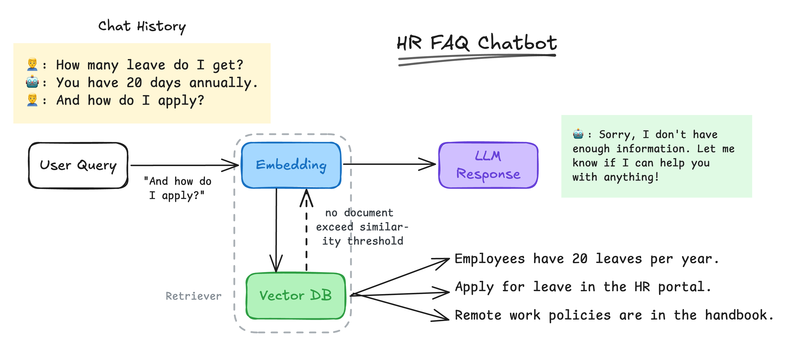
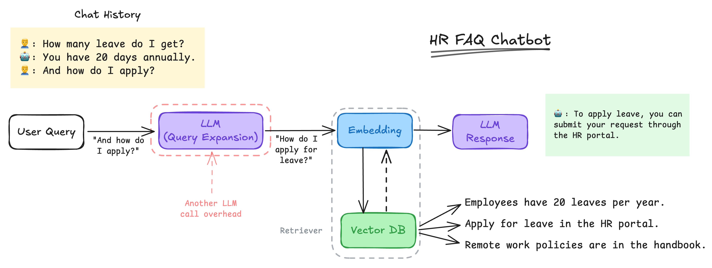
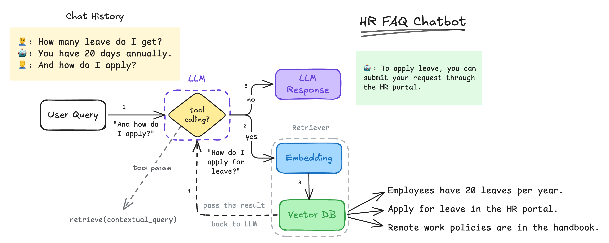

Building Retrieval-Augmented Generation (RAG) systems sounds straightforward in theory. But after working on several real-world RAG use cases—[FAQ chatbot builder](https://www.youtube.com/watch?v=CFd2MTHoIlA&list=PLy86Ve1I7c3goBsOPRUAMUMoEUpSX4zWd&index=1), image-to-image search, [product recommendation engines](https://wearesocial.com/sg/blog/2025/04/inside-skechers-new-ai-powered-shopping-experience-in-singapore/) and voice agents—I learned that the reality is far messier.

Rather than covering everything at once, I’m breaking this down into a short series of posts—each one focusing on a specific issue I encountered and how I approached fixing it.

In this first part, we’ll look at one of the most frequent problems: _**follow-up queries** that fail retrieval—and how **query expansion** helped solve it_.


## The Retrieval Doesn’t Remember — and That’s a Problem

With the intelligence of LLM, I've seen many end users expect it can handle multi-turn conversations naturally. But in reality, the retriever often fails to understand the context of incoming follow-up question resulting the *"I don't know"* kind of response (ofc we don't want it to produce hallucination responses either).

*"But we did put the conversation history. It should understand the context, no?"* – You might asked.

Yes, you're absolutely right. We did expose the conversation history to the LLM.

But the retriever didn't have it. Why?

Because the way retriever works is relied on Embedding models which do not take chat history. 

Normally, embedding model will take the input and convert it to a vector embedding. Then, it will be used to get the most similar document in the vector db. IF, there are no similar documents, it will return nothing, hence the LLM don't have materials to construct the correct response.

Consider the following use case.



At the first stage, when user ask how many leave do they have, the context is clear enough for both LLM and retriever. Because the *"leave"* term is explicitly mentioned.

However, at the second stage the context is vague for retriever as typically we will only pass the last message to embedding model. We won't pass the whole chat history as it will exceeds the limit tokens.

## Contextual Retrieval using Query Expansion

> 💡 *Anthropic present better way to handle this case. You can read their article [here](https://www.anthropic.com/news/contextual-retrieval).*

We know already the problem lies in the query that is being passed to the embedding. So, rather than simply passing them, we can actually ask the LLM to enhance the query with context based on the chat history.

Query expansion allows us to expand the original query with additional information from the chat history by add, inject, or rewrite the query itself. This method is commonly used in Information Retrieval (IR) system since long before the RAG era.

We can update our chatbot to the following.



We can put both chat history and current user query together, then asked the LLM to enhance the query context given the chat history. The enhanced query now will be helpful for the retriever to get relevant documents, resulting the final correct response.

Alternatively, if you don't want explicitly define the overhead LLM call, you may implement it in a tool call mode.



We only need to specify a function for LLM to execute with the parameter description. In this case, we have a `retrieve()` function with `contextual_query` as parameter.

Here's how we can implement it using Langchain. 

First, we prepare the documents and ingest to vectordb. For demonstration, we will use `InmMemoryVectorStore`. But in production you can use either Qdrant, ChromaDB, Weaviate, etc.
```python3
from langchain_core.vectorstores import InMemoryVectorStore
from langchain_core.documents import Document
from langchain_openai import OpenAIEmbeddings
import os

oai = OpenAIEmbeddings(api_key=os.getenv("OPENAI_API_KEY"), model="text-embedding-3-small")

docs = [
    Document(id=1, page_content="Employees have 20 leaves per year."),
    Document(id=2, page_content="Apply for leave in the HR portal."),
    Document(id=3, page_content="Remote work policies are in the handbook."),
]

# ingest document to vectordb
vectorstore = InMemoryVectorStore(oai)
await vectorstore.aadd_documents(docs)
```

<br>

Then, let's define our retrieval function that will be invoked by LLM.
```python3
from langchain.tools import tool

SIMILARITY_THRESHOLD = 0.5

@tool
async def retrieve(contextual_query: str):
    '''Retrieve relevant document for given query'''

    docs = [doc.page_content for doc, sim in 
            vectorstore.similarity_search_with_score(contextual_query) 
            if sim >= SIMILARITY_THRESHOLD]
    
    return "\n".join(docs)
```

<br>

Next, define our chain which consist of chat history, prompt, and chat model. Note that here we put a dummy chat history just to demonstrate the user's follow-up question. In real case, the chat history should inferred from actual conversation.
```python3
from langchain_openai import ChatOpenAI
from langchain.prompts import ChatPromptTemplate
from langchain_core.messages import HumanMessage, ToolMessage, AIMessage, SystemMessage

TOOLS = {"retrieve": retrieve}

system_prompt = '''You are a helpful internal HR assistant.
You are given a tool called `retrieve` to search for relevant documents based on a given query.
When invoking the tool, always enrich the query with the context based on chat history.'''

history = [
    SystemMessage(system_prompt),
    HumanMessage("How many leaves do I get?"),
    AIMessage("", tool_calls=[{"id": "1", "name": "retrieve", "args": {"contextual_query": "employee leave entitlements and policies"}}]),
    ToolMessage("Employees have 20 leaves per year.", tool_call_id="1"),
    AIMessage("You have 20 days annuallly."),
    ("human", "{query}")
]

prompt = ChatPromptTemplate.from_messages(history)

llm = ChatOpenAI(model="gpt-4o-mini", temperature=0.2).bind_tools([retrieve])
chain = prompt | llm
```

Notice that we also put an example of how the contextualized query and LLM response should be. This technique also called `Few-Shot Prompt` i.e. by giving the predefined example to guide the LLM what is the expected response looks like.


Let's try to interpret what is the expanded query looks like.
```python3
res.model_dump()
```
```bash
{'content': '',
 'additional_kwargs': {'tool_calls': [{'id': 'call_6G9yXNrxB6Qrz8trICYZLCsz',
    'function': {'arguments': '{"contextual_query":"how to apply for leave in the company"}',
     'name': 'retrieve'},
    'type': 'function'}],
  'refusal': None},
 'response_metadata': {'token_usage': {'completion_tokens': 22,}
 ...
 }]
}
```
As we can see, the `contextualized_query` argument is contains of our original query and additional context inferred from the chat history.

Finally, let's handle the function invoke and pass the output back to LLM to get final response.
```python3
while res.tool_calls:
    for tcall in res.tool_calls:
        # execute each function call
        msg = await TOOLS[tcall['name'].lower()].ainvoke(tcall)
        # add the response to history
        history.append(msg)
    
    # get LLM response along with function calling output
    res = chain.invoke(history)
    history.append(res)

print(res.content)
```
```
To apply for leave, you can do so through the HR portal.
Remember, you have 20 leaves available per year.
```

Nice! Our retrieval system now has been succesfully identify user's follow-up question and contextually enrich them to retrieve relevant document from vectordb.

> ⚠️ Remember there is no single-solution-for-all, this technique is only one of many others. It may not robust on the other case. Though it is worked quite well for most of my cases so far.

## Conclusion

Effective Retrieval-Augmented Generation (RAG) systems depend on understanding context, especially for follow-up queries. By employing techniques like query expansion, we can enhance the relevancy of responses and ensure smoother multi-turn conversations.

While this method is beneficial, it's essential to remember that this approach is not a one-size-fits-all solution and may require adaptation for different contexts.


---

### Let’s get Connected 🙌
If you have any inquiries, comments, suggestions, or critics please don’t hesitate to reach me out:

- Mail: affahrizain@gmail.com
- LinkedIn: https://www.linkedin.com/in/fahrizainn/
- GitHub: https://github.com/fhrzn