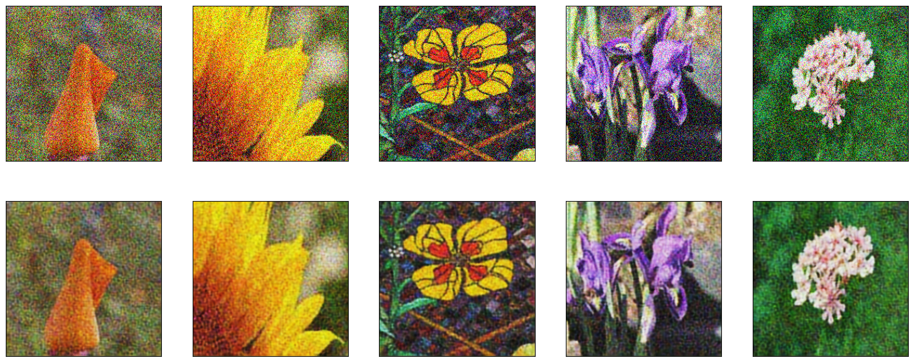

> *This is the next series of my notes while exploring autoencoders.*
> *You may also interested to read my other notes on Autoencoder network:*
>
> *1. [Autoencoders: Your First Step into Generative AI](https://fhrzn.github.io/posts/autoencoders-your-first-step-into-generative-ai/)* 
>
> *2. **Restore your Noisy Image using Autoencoders***


## Convolutional Autoencoder (CAE)

In the previous article, we implemented the image compression model using Linear Autoencoder. However, when it comes to larger image and having more colors (RGB, not grayscale or just black and white) it is a good idea to try incorporating Convolutional layer instead of simple Linear layer. You may do your mini research by yourself, but this time let’s just modify our network using Convolutional layer.

Before we deep dive to code, let’s cover some basic theory so we can completely understand what is happening in our model.

### Convolutional Network

](images/cnn.jpeg#center)
source: [https://medium.com/analytics-vidhya/vggnet-convolutional-network-for-classification-and-detection-3543aaf61699](https://medium.com/analytics-vidhya/vggnet-convolutional-network-for-classification-and-detection-3543aaf61699)

Let’s do quick review how Convolutional Neural Network (CNN) works.

*What will happen if we feed our original image with size 512x512 pixel into our model?*
Well, if our image is grayscale it would produce `512 * 512 = 262,144 data`. While if our image is RGB, it would produce `512 * 512 * 3 = 786,432 data`. And that’s a lot for our computer memory! 

This is where the implementation of CNN is certainly needed.

Basically, CNN used a so-called kernel to “scan” each part of the image. This kernel is actually 2-dimensional matrix within size $M\times N$. It travels through whole image by moving within $S$ stride on each step. And this kernel is duplicated as much as image’s channels size, for example colorful image will have 3 channels for each Red Green Blue colors. Therefore, there will be 3 for such image.

For easier interpretation you may see the illustration below.

](images/cnn_kernel.gif#center)
source: [https://www.quora.com/How-does-a-convolutional-layer-convert-a-64-channel-input-into-a-3-channel-or-one-channel](https://www.quora.com/How-does-a-convolutional-layer-convert-a-64-channel-input-into-a-3-channel-or-one-channel)

The above step will produce a “projection layer” which contains the observation of each kernels as shown in the previous illustration. Then, from this projection layer we will try to reduce the pixel size by applying a Pooling layer.

There are two popular kind of Pooling layer, Max Pooling and Average Pooling. And you can guess by its name, the former one reduce the data dimension by taking the maximum on each observation space, while the latter perform it by taking the average.

](images/pooling_layers.png#center)

source: [https://medium.com/aiguys/pooling-layers-in-neural-nets-and-their-variants-f6129fc4628b](https://medium.com/aiguys/pooling-layers-in-neural-nets-and-their-variants-f6129fc4628b)

Finally, the reduced data will be passed to the next layer and will be going through the same process every time it passed to CNN layers.

> *Note that you may look for other references for further explanation of CNNs as we won’t cover it too much here.*
> 

### What CNN’s Actually do?

Overall, as in my understanding, I could say that CNN operation is trying to extract features and reduce the data dimension at the same time. By applying Max pooling or Average pooling, it expected to keeps the relevant information while reducing the dimension.

## CAE Network Design

The network design for Convolutional based autoencoder was basically same with the Linear one. There are Encoder, Decoder, and Latent space. However, the key differences is located on how we implement Encoder and Decoder layers.

### Encoder Layer

The Encoder layer design is not complicated as it is very similar to common CNN implementation for classification. The layers, of course, designed to shrink as it closer to the latent space, expecting it to extract key features of our images and map it to $C\times W\times H$ of latent space.

where:

$C:$ channels

$W:$ image width

$H:$ image height


In the last layer of encoder output, you may choose to flatten it then feed to Linear layer or leave it as is for the latent space. 

*(P.S. if you have opinions or best practices, please don’t hesitate to leave it in comment section)*

### Decoder Layer

The Decoder layer design in general still the same to regular autoencoder network, which is need to expand over the time (the opposite shape of encoder layer). However, there are some adjustment to the convolutional layer for the decoder.

While convolutional layer is intended to reduce the data dimension size, we need to make it do the opposite for the implementation in Decoder layer. Instead of shrink the dimension, it needs to upsample it. Fortunately, in PyTorch we can achieve it easily with `Conv2dTranspose` layer. 

](images/convtranspose.gif#center)

source: [https://stackoverflow.com/a/55119869](https://stackoverflow.com/a/55119869)

In short, we can say it do the opposite operation of regular CNN layer. And we will use it to upsample our latent space back to its original size image.


If you are looking for more explanation on this upsample operation, I recommend you to watch [Intro to Deep Learning and Generative Models Course](https://www.youtube.com/watch?v=345wRyqKkQ0&list=PLTKMiZHVd_2KJtIXOW0zFhFfBaJJilH51&index=139) by [Sebastian Raschka](https://www.youtube.com/@SebastianRaschka).

## Coding Time!

This time we will try to denoise flowers image using Convolutional Autoencoders. We will use 16 different [Flowers dataset which available in Kaggle](https://www.kaggle.com/datasets/l3llff/flowers).

If you wants to jump ahead into the notebook, [please visit this link](https://www.kaggle.com/code/affand20/denoising-autoencoder/notebook).

### Dataset Preparation

Let’s import the necessary libraries and setup our base config.

```python
# data manipulation
import numpy as np
import matplotlib.pyplot as plt
import pandas as pd

# utils
import os
import gzip
import string
from tqdm.auto import tqdm
import time
import random

# sklearn
from sklearn.model_selection import train_test_split

# torch
import torch
from torchvision.datasets import ImageFolder
import torchvision.transforms as transforms
import torch.nn as nn
import torch.nn.functional as F
from torch.utils.data import DataLoader, Subset

class config:
    batch_size = 128
    device = 'cuda' if torch.cuda.is_available() else 'cpu'
    epochs = 20
    learning_rate = 1e-3
    log_step = 50
    seed=42
    latent_dim = 32
    inp_out_dim = 784
    hidden_dim = 128
```

We wants to make sure that all images must be in size 256 x 256. Therefore, we can add a transformation operation to crop and resize the image.

```python
# transform data
transform = transforms.Compose([
    transforms.RandomResizedCrop(256),    # crop and/or resize image to 256x256
    transforms.ToTensor()
])
```

Now, since our dataset is only images stored in folders, we may load it to pytorch using ImageFolder utils from torchvision like this. Don’t forget to pass our previously defined transformation operations.

```python
# load data from folder
dataset = ImageFolder(root="/kaggle/input/flowers/flowers", transform=transform)
target = dataset.targets
```

Then, let’s make train–test split and setup our dataloaders.

```python
# make train test split
train_idx, test_idx = train_test_split(np.arange(len(dataset)), test_size=0.2, stratify=target, random_state=42)
train_subset = Subset(dataset, indices=train_idx)
test_subset = Subset(dataset, indices=test_idx)

# make trainloader
trainloader = DataLoader(train_subset, batch_size=config.batch_size, shuffle=True)
testloader = DataLoader(test_subset, batch_size=config.batch_size, shuffle=True)
```

### Designing Model Architecture

It’s time to implement our previous discussion on the convolutional autoencoder network!

For the encoder part, let’s stack 4 Convolutional layers with shrinking output to its end.

```python
# encoder
self.encoder = nn.Sequential(
    nn.Conv2d(3, 16, 3, padding=1, stride=1),
    nn.ReLU(),
    nn.Conv2d(16, 32, 3, padding=1, stride=2),
    nn.ReLU(),
    nn.Conv2d(32, 64, 3, padding=1, stride=2),
    nn.ReLU(),
    nn.Conv2d(64, 128, 3, padding=1, stride=2),
)
```

Here, I am trying to reduce the data dimension by using only `stride` parameter instead of employing the Max Pooling layer. You may try it by yourself to incorporate the Max Pooling layer and leave the `stride` parameter as 1.

>💡 *There is also discussion whether to use stride or max pooling layer for reducing data dimension. You can find it here: [https://stats.stackexchange.com/questions/387482/pooling-vs-stride-for-downsampling](https://stats.stackexchange.com/questions/387482/pooling-vs-stride-for-downsampling)*

During the process, I found difficulties to guess what is the output size of each convolution layers. Then I found the full explanation and guide from Stanford which I find very useful. Here is the link: [https://cs231n.github.io/convolutional-networks/#layers](https://cs231n.github.io/convolutional-networks/#layers).

Or simply, you can follow this formula which I obtained from the link above.

$$
(W−F+2P)/S+1
$$

where:

$W:$ input volume size

$F:$ kernel (filter) size

$P:$ padding size

$S:$ stride size

Now, for the decoder part, as the opposite of the encoder layer, let’s stack 4 Transpose Convolutional layers with expanding output to its end.

```python
# decoder
self.decoder = nn.Sequential(
    nn.ConvTranspose2d(128, 64, 3, padding=1, stride=2),
    nn.ReLU(),
    nn.ConvTranspose2d(64, 32, 3, padding=0, stride=2),
    nn.ReLU(),
    nn.ConvTranspose2d(32, 16, 3, padding=0, stride=2),
    nn.ReLU(),
    nn.ConvTranspose2d(16, 3, 2, padding=0, stride=1),   # for the final layer I used kernel size 2, as I found it empirically match the original input image size
    nn.Sigmoid()
)
```

Honestly, specific on this part I still had a difficulties to tell the reason why the `padding` need to set as 0 and the final `stride` to 1. What I did was actually following the tutorial [here](https://github.com/udacity/deep-learning-v2-pytorch/blob/master/autoencoder/denoising-autoencoder/Denoising_Autoencoder_Solution.ipynb) and [here](https://github.com/rasbt/stat453-deep-learning-ss21/blob/main/L16/conv-autoencoder_mnist.ipynb) and do my observation through try and error by feeding random tensor in equal shape with the latent space to this network.

While to calculate the output of each Transpose Convolutional layer, I follow its formula defined on PyTorch page here: [https://pytorch.org/docs/stable/generated/torch.nn.ConvTranspose2d.html](https://pytorch.org/docs/stable/generated/torch.nn.ConvTranspose2d.html).

Finally, the forward function is defined as follows:

```python
def forward(self, x):
		x = self.encoder(x)
		x = self.decoder(x)
		
		return x
```

The full code:

```python
# define our network
class ConvDenoiseAutoencoder(nn.Module):
    def __init__(self):
        super(ConvDenoiseAutoencoder, self).__init__()
        
        # encoder
        self.encoder = nn.Sequential(
            nn.Conv2d(3, 16, 3, padding=1, stride=1),
            nn.ReLU(),
            nn.Conv2d(16, 32, 3, padding=1, stride=2),
            nn.ReLU(),
            nn.Conv2d(32, 64, 3, padding=1, stride=2),
            nn.ReLU(),
            nn.Conv2d(64, 128, 3, padding=1, stride=2),
        )
        
        # here we downsample the image using only stride instead of maxpool.
        # you may try maxpool approach as it is only my experiment using stride.
        # see discussion here: https://stats.stackexchange.com/questions/387482/pooling-vs-stride-for-downsampling
        
        # decoder
        self.decoder = nn.Sequential(
            nn.ConvTranspose2d(128, 64, 3, padding=1, stride=2),
            nn.ReLU(),
            nn.ConvTranspose2d(64, 32, 3, padding=0, stride=2),
            nn.ReLU(),
            nn.ConvTranspose2d(32, 16, 3, padding=0, stride=2),
            nn.ReLU(),
            nn.ConvTranspose2d(16, 3, 2, padding=0, stride=1),   # for the final layer I used kernel size 2, as I found it empirically match the original input image size
            nn.Sigmoid()
        )

        
    def forward(self, x):
        x = self.encoder(x)
        x = self.decoder(x)
        
        return x
```

Let’s define our model and see its architecture.

```python
# define model
model = ConvDenoiseAutoencoder()

# move to GPU device
model = model.to(config.device)
print(model)
```

```
ConvDenoiseAutoencoder(
  (encoder): Sequential(
    (0): Conv2d(3, 16, kernel_size=(3, 3), stride=(1, 1), padding=(1, 1))
    (1): ReLU()
    (2): Conv2d(16, 32, kernel_size=(3, 3), stride=(2, 2), padding=(1, 1))
    (3): ReLU()
    (4): Conv2d(32, 64, kernel_size=(3, 3), stride=(2, 2), padding=(1, 1))
    (5): ReLU()
    (6): Conv2d(64, 128, kernel_size=(3, 3), stride=(2, 2), padding=(1, 1))
  )
  (decoder): Sequential(
    (0): ConvTranspose2d(128, 64, kernel_size=(3, 3), stride=(2, 2), padding=(1, 1))
    (1): ReLU()
    (2): ConvTranspose2d(64, 32, kernel_size=(3, 3), stride=(2, 2))
    (3): ReLU()
    (4): ConvTranspose2d(32, 16, kernel_size=(3, 3), stride=(2, 2))
    (5): ReLU()
    (6): ConvTranspose2d(16, 3, kernel_size=(2, 2), stride=(1, 1))
    (7): Sigmoid()
  )
)
```

### Add Noise to Images

In order to make our model understand to clean the noise from images, we first need to introduce a random noise to the original images.

```python
# get one batch from trainloader
features, _ = next(iter(trainloader))

# define random noise and how much its influence
noise_factor = .5
noise = noise_factor * torch.randn(*features.shape)
noisy_img = features + noise
# keep image colors stay in scale between 0 to 1
features = torch.clamp(noisy_img, 0., 1.)
```


Note that the denoising autoencoder learn the representation by measuring the distance between the generated image and the original one. The generated image here is the attempt output of denoising autoencoder network.

By minimizing the distance between noisy and original one, it means the model will also learn to remove the noise or at least reduce it.

### Noise Probability

During training phase, I found its challenging for our model to learn image representation if the whole training data are corrupted. Therefore, as part of my experiment, I tried to add threshold probability to determine whether batch of images need to be corrupted or not.

```python
# add noise to image
if random.random() > p:
    if noise_factor:
        noise = noise_factor * torch.randn(*features.shape)
        noisy_img = features + noise
        features = torch.clamp(noisy_img, 0., 1.)
```

By adding threshold probability, we let some non-corrupted dataset to be learned as well. And by doing so, we hope the model will be able to learn underlying images representation and have a little insight on difference between the corrupted and non-corrupted images.

## Training Model

Let’s now define our training loop. Here we would like to wrap our code inside a function, so we can reproduce easily later and the code itself become cleaner.

```python
def train(model, noise_factor: float = None, p_threshold: float = 0.0):
    # loss and optimizer
    criterion = nn.MSELoss()
    optimizer = torch.optim.Adam(model.parameters(), lr=config.learning_rate)
    
    # loss logging
    history = {
        'train_loss': []
    }
    
    # progressbar
    num_train_steps = len(trainloader) * config.epochs
    progressbar = tqdm(range(num_train_steps))

    epochtime = time.time()
    for epoch in range(config.epochs):

        trainloss = 0
        batchtime = time.time()

        for idx, batch in enumerate(trainloader):
            # unpack data
            features, _ = batch

						**# add noise to image
            if random.random() > p:
                if noise_factor:
                    noise = noise_factor * torch.randn(*features.shape)
                    noisy_img = features + noise
                    features = torch.clamp(noisy_img, 0., 1.)**

            features = features.to(config.device)

            # clear gradient
            optimizer.zero_grad()

            # forward pass
            output = model(features)

            # calculate loss
            loss = criterion(output, features)
            loss.backward()

            # optimize
            optimizer.step()

            #  update running training loss
            trainloss += loss.item()

            # update progressbar
            progressbar.update(1)
            progressbar.set_postfix_str(f"Loss: {loss.item():.3f}")

            # log step
            if idx % config.log_step == 0:
                print("Epoch: %03d/%03d | Batch: %04d/%04d | Loss: %.4f" \
                      % ((epoch+1), config.epochs, idx, \
                         len(trainloader), trainloss / (idx + 1)))

        # log epoch
        history['train_loss'].append(trainloss / len(trainloader))
        print("***Epoch: %03d/%03d | Loss: %.3f" \
              % ((epoch+1), config.epochs, loss.item()))

        # log time
        print('Time elapsed: %.2f min' % ((time.time() - batchtime) / 60))

    print('Total Training Time: %.2f min' % ((time.time() - epochtime) / 60))
    
    return model, history
```

And the function call itself.

```python
model, history = train(model, noise_factor=0.15, p_threshold=0.5)
```

Here we are training our model with probability of data corruption 0.5 and the noise factor itself 0.15.

After training for a while, let’s now plot our train loss history.

```python
plt.figure(figsize=(5, 7))
plt.plot(range(len(history['train_loss'])), history['train_loss'], label='Train Loss')
plt.xlabel('Epochs')
plt.ylabel('MSE Loss')
plt.legend()
plt.show()
```


## Testing time!

```python
testloss = 0
testtime = time.time()
criterion = nn.MSELoss()
noise_factor = 0.25

for batch in tqdm(testloader):
    # unpack data
    test_feats, _ = batch
    
    **# add noise to image
    if noise_factor:
        noise = noise_factor * torch.randn(*test_feats.shape)
        noisy_img = test_feats + noise
        test_feats = torch.clamp(noisy_img, 0., 1.)**
    
    test_feats = test_feats.to(config.device)
    # forward pass
    with torch.no_grad():
        test_out = model(test_feats)
    # compute loss
    loss = criterion(test_out, test_feats)
    testloss += loss.item()

print('Test Loss: %.4f' % (testloss / len(testloader)))
print('Total Testing Time: %.2f min' % ((time.time() - testtime) / 60))
```


### Visualize our Test Result

Let’s take the first 5 original and reconstructed image from latest batch in test set.

```python
orig = test_feats[:5].detach().cpu()
recon = test_out[:5].detach().cpu()

fig, axes = plt.subplots(2, 5, sharex=True, sharey=True, figsize=(20, 8))

for images, row in zip([orig, recon], axes):
    for img, ax in zip(images, row):
        ax.imshow(img.permute(1, 2, 0))
        ax.get_xaxis().set_visible(False)
        ax.get_yaxis().set_visible(False)
```



Great! Based on the result, although the image not completely denoised, our model seems to be able reduce it a little bit. You may also try to inference your denoised image several time and see if the noise will be more reduced.

## Further Exploration

### Experiment with Different Model Architecture

To fulfill my curiosity, I tried incorporate the Max Pooling layer. So I changed the model architecture to be like this.

```python
class ConvDenoiseAutoencoderV3(nn.Module):
    def __init__(self):
        super(ConvDenoiseAutoencoderV3, self).__init__()
        
        # encoder
        self.encoder = nn.Sequential(
            nn.Conv2d(3, 16, 3, padding=1, stride=1),
            nn.ReLU(),
            nn.MaxPool2d(2, 2),
            nn.Conv2d(16, 32, 3, padding=1, stride=1),
            nn.ReLU(),
            nn.MaxPool2d(2, 2),
            nn.Conv2d(32, 64, 3, padding=1, stride=1),
            nn.ReLU(),
            nn.MaxPool2d(2, 2),
            nn.Conv2d(64, 128, 3, padding=1, stride=1),
            nn.ReLU(),
            nn.MaxPool2d(2, 2)
        )
        
        # decoder
        self.decoder = nn.Sequential(
            nn.ConvTranspose2d(128, 128, 3, stride=2),
            nn.ReLU(),
            nn.ConvTranspose2d(128, 64, 2, padding=1, stride=2),
            nn.ReLU(),
            nn.ConvTranspose2d(64, 32, 2, stride=2),
            nn.ReLU(),
            nn.ConvTranspose2d(32, 16, 2, stride=2),   # for the final layer I used kernel size 2, as I found it empirically match the original input image size
            nn.ReLU(),
            nn.Conv2d(16, 3, 3, padding=1),
            nn.Sigmoid()
        )
        
    def forward(self, x):
        x = self.encoder(x)
        x = self.decoder(x)
        
        return x
```

```
ConvDenoiseAutoencoderV3(
  (encoder): Sequential(
    (0): Conv2d(3, 16, kernel_size=(3, 3), stride=(1, 1), padding=(1, 1))
    (1): ReLU()
    (2): MaxPool2d(kernel_size=2, stride=2, padding=0, dilation=1, ceil_mode=False)
    (3): Conv2d(16, 32, kernel_size=(3, 3), stride=(1, 1), padding=(1, 1))
    (4): ReLU()
    (5): MaxPool2d(kernel_size=2, stride=2, padding=0, dilation=1, ceil_mode=False)
    (6): Conv2d(32, 64, kernel_size=(3, 3), stride=(1, 1), padding=(1, 1))
    (7): ReLU()
    (8): MaxPool2d(kernel_size=2, stride=2, padding=0, dilation=1, ceil_mode=False)
    (9): Conv2d(64, 128, kernel_size=(3, 3), stride=(1, 1), padding=(1, 1))
    (10): ReLU()
    (11): MaxPool2d(kernel_size=2, stride=2, padding=0, dilation=1, ceil_mode=False)
  )
  (decoder): Sequential(
    (0): ConvTranspose2d(128, 128, kernel_size=(3, 3), stride=(2, 2))
    (1): ReLU()
    (2): ConvTranspose2d(128, 64, kernel_size=(2, 2), stride=(2, 2), padding=(1, 1))
    (3): ReLU()
    (4): ConvTranspose2d(64, 32, kernel_size=(2, 2), stride=(2, 2))
    (5): ReLU()
    (6): ConvTranspose2d(32, 16, kernel_size=(2, 2), stride=(2, 2))
    (7): ReLU()
    (8): Conv2d(16, 3, kernel_size=(3, 3), stride=(1, 1), padding=(1, 1))
    (9): Sigmoid()
  )
)
```

### Experimental Result

We keep the training setup same to our previous setup. The only difference is now we are setting noise probability to 0 and noise_factor to 0.5, ensuring that all images are quite badly corrupted.

```python
model, history = train(model, noise_factor=0.5, p_threshold=0.0)
```

With that settings, here is our training loss looks like.


And finally, this is our denoised images using such architecture.


From the output we could tell that the model might be able to remove noise better than our previous model architecture. However, the generated result seems to be blurred.

Again, our model architecture is very simple compared to the latest image reconstruction architecture. Of course the performance and reconstruction quality is differs by large margin. You may try to improve the model architecture or implement published paper’s architecture.

# Conclusion

Now we know more advanced Autoencoder architecture using Convolutional layers. The key difference is how our image will be processed through each layer. It works by reducing the dimension of images and projected to specific size of dimension.

We also discovered how to corrupt image simply by creating random noise and add it to our data. By learning the distance between corrupted images and the original one, it is expected that our model is able to remove (or at least reduce) the noise from image, leaving better image quality.

If you have any inquiries, comments, suggestions, or critics please don’t hesitate to reach me out:

- Mail: [affahrizain@gmail.com](mailto:affahrizain@gmail.com)
- LinkedIn: [https://www.linkedin.com/in/fahrizainn/](https://www.linkedin.com/in/fahrizainn/)
- GitHub: [https://github.com/fhrzn](https://github.com/fhrzn)

Until next time! 👋

---

# References

1. [Intro to Deep Learning and Generative Models Course](https://www.youtube.com/watch?v=345wRyqKkQ0&list=PLTKMiZHVd_2KJtIXOW0zFhFfBaJJilH51&index=139) by [Sebastian Raschka](https://www.youtube.com/@SebastianRaschka).
2. [Udacity Intro to Deep Learning with Pytorch Github repos](https://github.com/udacity/deep-learning-v2-pytorch/blob/master/autoencoder/denoising-autoencoder/Denoising_Autoencoder_Solution.ipynb)
3. [CS231n Convolutional Neural Networks for Visual Recognition](https://cs231n.github.io/convolutional-networks/#layers) by Stanford
4. [Pooling vs Stride for downsampling](https://stats.stackexchange.com/questions/387482/pooling-vs-stride-for-downsampling)
5. [Autoencoders in Deep Learning](https://www.v7labs.com/blog/autoencoders-guide) by V7