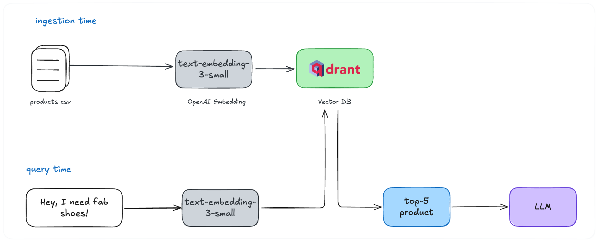
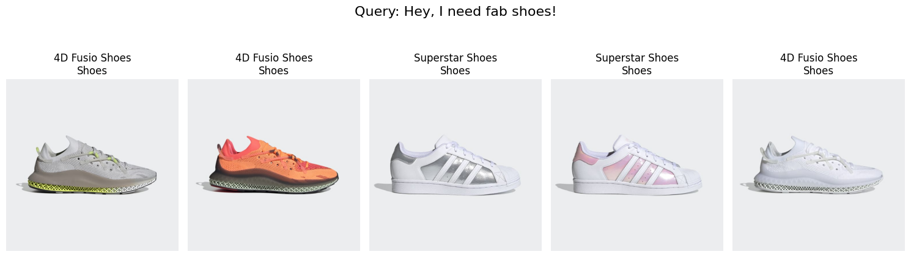
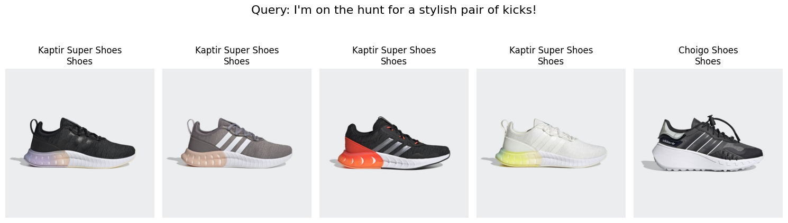
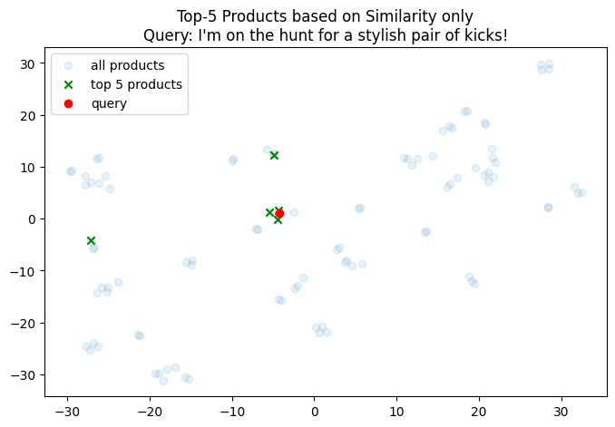
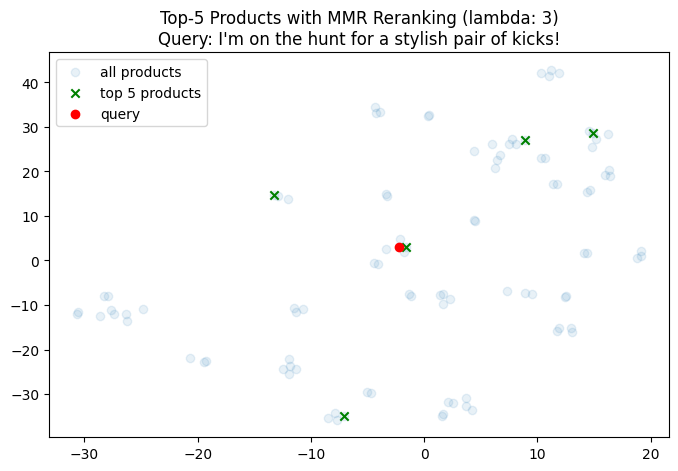
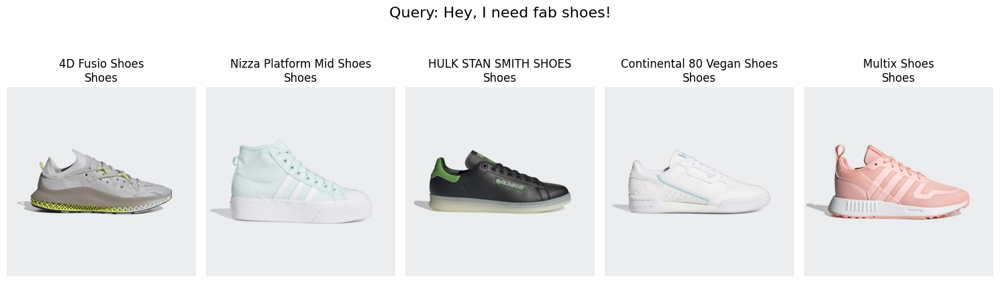
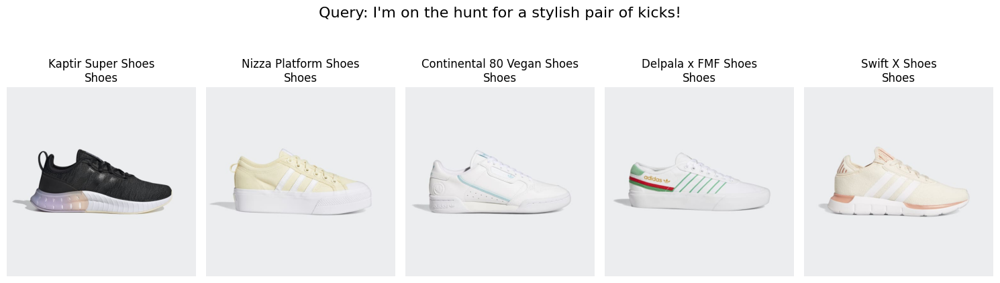
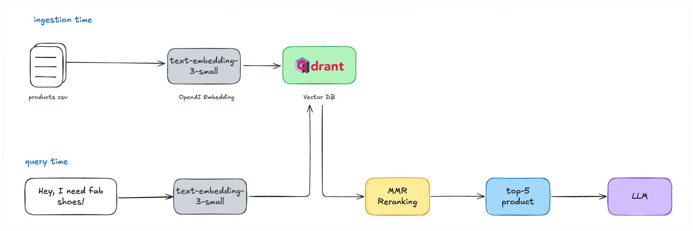

On my journey building a RAG-based product recommendation system, I learned one important lesson: adding diversity aspect in search space is beneficial for end users. 

At the end, I stumbled upon the **Maximal Marginal Relevance (MMR)** algorithm which is simple but enough to improve our user satisfaction.

So, in this article I'll explain how MMR works, its benefits, and how it can be integrated into a RAG system for product recommendation.

## RAG for Product Recommendation

If you've been working on RAG before, you must be familiar enough with the similarity-based retrieval process.

However, if you are new to this field, you may want to read our previous article to grasp [the concept of RAG and Vector Database](https://fhrzn.github.io/posts/building-conversational-ai-chat-with-your-data/#vector-database).

Nothing fancy here honestly, no agentic, no buzzwords, just basic RAG architecture.



Initially, this simple setup is working fine. We got question from the user, transform it into a vector embedding, perform similarity search towards data in vector db, obtain the result, pass it to LLM to generate natural answers.

Oh, there is an additional rule. The system must give only one recommendation at a time. Since we passed top-5 products, the LLM then need to decide which one is most related to user query, preferences, and previous conversation.

But let's focus only on the retrieval part in this article.

Now, given our simple approach, our team finds the retrieval feels like to have its own *"preferences"* on recommending products. Or we can formally say it slightly *"biased"* towards specific products.

Take a look at the examples below:




At a glance, everything seems fine.

But if we take a closer look, among 5 retrieved products, 3-4 out of 5 are having exactly same type just different colors.

Even we tried different queries, most of the time the retrieval system will pick very close product to each other.

Unfortunately, this case didn't pass User Acceptance Test (UAT) due to lack of product diversity – or in their term *"system preference"*.

## Maximum Marginal Relevance (MMR)

MMR is a post-processing technique that helps to remove redundant documents by penalize its similarity score.

In our case, we need to *__retrieve relevant products which also diverse each other__*, which is where MMR is suited.

Here's the MMR formula:

$$
[ \text{MMR}(d_i) = \lambda \cdot \text{Relevance}(d_i, q) - (1 - \lambda) \cdot \max_{d_j \in S} \text{Similarity}(d_i, d_j) ]
$$

Where:

$\lambda:$ Balancing parameter. To controls the trade-off (relevance – diverse)

$\text{Relevance}:$ The relevance score of retrieved document $d_i$ w.r.t query $q$

$\max_{d_j \in S} \text{Similarity}(d_i, d_j): $ maximum similarity between the candidate document $d_i$ and any of the already selected documents $d_j$ in set $S$

### Why is this work?

Remember that the way RAG and Vector DB work is by comparing similarity between document and query embeddings.

In most setting, cosine similarity will be used as scoring method – which will return the most similar documents to our query.



In the example above, among the top-5 products 3 of them is very close to the query points. This will introduces the *"system preference"* as we define earlier.

### How MMR helps?

Remember that we have $\lambda$ parameter that is responsible to control the trade-off between relevance and diversity.

The bigger $\lambda$ is, the more similar products will be selected. And the smaller it is, the more diverse products will be.



Given the same query, we applied MMR algorithm with $\lambda = 0.3$ (more diverse). The final top-5 products as can be seen are quite far each other in vector spaces.

And it can be validated by checking the MMR-applied retrieval result below:




## Integrate MMR to our RAG System

Since MMR is a post-processing method, our RAG architecture will have an additional step before the products are sent to the LLM.



> 💡 I've previously ingest the product data which you can find it [here]().
>
> Additionally, if you want to jump directly to the code you can find it [here]().

### Install Dependencies
```bash
pip install openai qdrant-client pillow matplotlib scikit-learn numpy
```

### Imports and Client Initialization
```python
from openai import OpenAI
import polars as pl
import uuid
import httpx
import asyncio
from qdrant_client import QdrantClient, models
import matplotlib.pyplot as plt
from PIL import Image

from sklearn.manifold import TSNE
import numpy as np

# CONFIG
OPENAI_API_KEY = "<OPENAI-API-KEY>"
OPENAI_EMBEDDING_MODEL = "text-embedding-3-small"
QDRANT_HOST = "localhost"
QDRANT_PORT = 6333
QDRANT_COLLECTION_NAME = "adidas_products"

CHROMADB_HOST = "localhost"
CHROMADB_PORT = 3456
CHROMADB_COLLECTION_NAME = "adidas_products"

# INIT
oai_client = OpenAI(api_key=OPENAI_API_KEY)
qdrant_client = QdrantClient(host=QDRANT_HOST, port=QDRANT_PORT)
```

### Retrieve Relevant Products
```python3
query = "Hey, I need fab shoes!"

query_embeds = oai_client.embeddings.create(
    input=query, 
    model=OPENAI_EMBEDDING_MODEL)

res = qdrant_client.query_points(
    collection_name=QDRANT_COLLECTION_NAME,
    query=query_embeds.data[0].embedding,
    with_vectors=True,
    limit=100,
)
```
First, we fetch top-100 relevant products. Then, we will apply MMR and reduce the result into only 5 products.


### Define MMR Reranking Function
```python3
from sklearn.metrics.pairwise import cosine_similarity
from typing import List
import numpy as np

def maximal_marginal_relevance(
    query_embedding: np.ndarray,
    embedding_list: list,
    lambda_mult: float = 0.5,
    k: int = 4,
) -> List[int]:
    """Calculate maximal marginal relevance.
    
    Usage example:
    ```python
    mmr_selected = maximal_marginal_relevance(
        query_embedding=np.array(query_embed, dtype=np.float32),
        embedding_list=ret_docs["embeddings"][0],
        lambda_mult=0.4,
        k=10
    )

    print(mmr_selected)
    
    # Output
    >>> [0, 9, 6, 12, 1, 17, 7, 2, 5, 19]
    ```
    
    """
    if min(k, len(embedding_list)) <= 0:
        return []
    if isinstance(query_embedding, list):
        query_embedding = np.array(query_embedding)
    if query_embedding.ndim == 1:
        query_embedding = np.expand_dims(query_embedding, axis=0)
    similarity_to_query = cosine_similarity(query_embedding, embedding_list)[0]
    most_similar = int(np.argmax(similarity_to_query))
    idxs = [most_similar]
    selected = np.array([embedding_list[most_similar]])
    while len(idxs) < min(k, len(embedding_list)):
        best_score = -np.inf
        idx_to_add = -1
        similarity_to_selected = cosine_similarity(embedding_list, selected)
        for i, query_score in enumerate(similarity_to_query):
            if i in idxs:
                continue
            redundant_score = max(similarity_to_selected[i])
            equation_score = (
                lambda_mult * query_score - (1 - lambda_mult) * redundant_score
            )
            if equation_score > best_score:
                best_score = equation_score
                idx_to_add = i
        idxs.append(idx_to_add)
        selected = np.append(selected, [embedding_list[idx_to_add]], axis=0)
    return idxs
```

### Apply MMR Reranking
```python3
MMR_LAMBDA_MULT = 0.3   # prioritize diversity
MMR_K = 5   # number of results to return

# collect top-100 embeddings
top_100_embeddings = [item.vector for item in res.points]

# re-rank using MMR then take top-5 result
top_5_mmr_indices = maximal_marginal_relevance(emb.embedding, top_100_embeddings, MMR_LAMBDA_MULT, MMR_K)
top_5_mmr = [res.points[i] for i in top_5_mmr_indices]
top_5_mmr_payload = [item.payload["metadata"] for item in top_5_mmr]
```

### Visualize Products
```python3
def visualize_product_rows(query, payload):
    fig, ax = plt.subplots(1, len(payload), figsize=(15, 8))

    for i, product in enumerate(payload):
        ax[i].imshow(Image.open(product["productImage"]))
        ax[i].set_title(f"{product['productName']}\n{product['productCategory']}")
        ax[i].set_axis_off()

    fig.suptitle(f"Query: {query}", fontsize=16)
    plt.tight_layout(rect=[0, 0, 1, 1.35])
    plt.show()

visualize_product_rows(q, top_5_mmr_payload)
```

And here is the result of our MMR reranked products.


## Conclusion

By incorporating Maximal Marginal Relevance (MMR) into our RAG-based product recommendation system, we were able to tune the diversity of retrieved products, eliminating so-called *"system preference"* from end user perspective. Ultimately, MMR enable our system to retrieve relevant **and** diverse products.

### Key Takeaways

- **MMR Algorithm**, helps to remove redundant recommendations by evaluating relevance and maximizing diversity among selected products.
- **Parameter Tuning**, adjust the $\lambda$ parameter allows for fine control over the trade-off between relevance and diversity, enabling a tailored user experience.
- **Diversity Enhances Satisfaction**, though may be different for some users, in our case, a varied selection of products leads to a better user experience and higher engagement rates.

---

### Let’s get Connected 🙌
If you have any inquiries, comments, suggestions, or critics please don’t hesitate to reach me out:

- Mail: affahrizain@gmail.com
- LinkedIn: https://www.linkedin.com/in/fahrizainn/
- GitHub: https://github.com/fhrzn